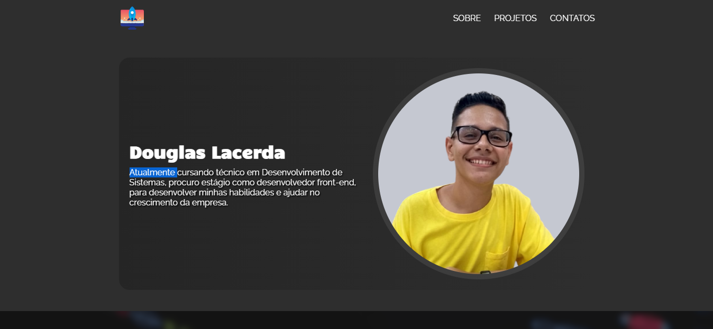
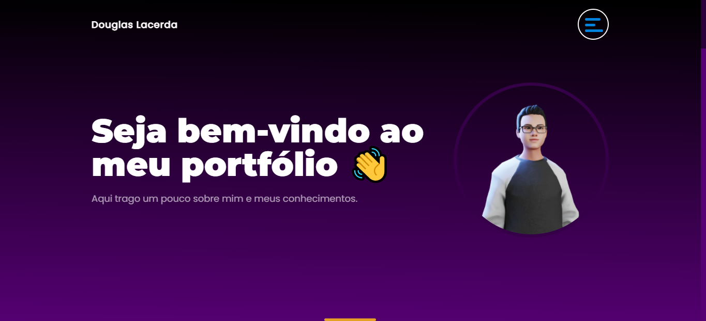
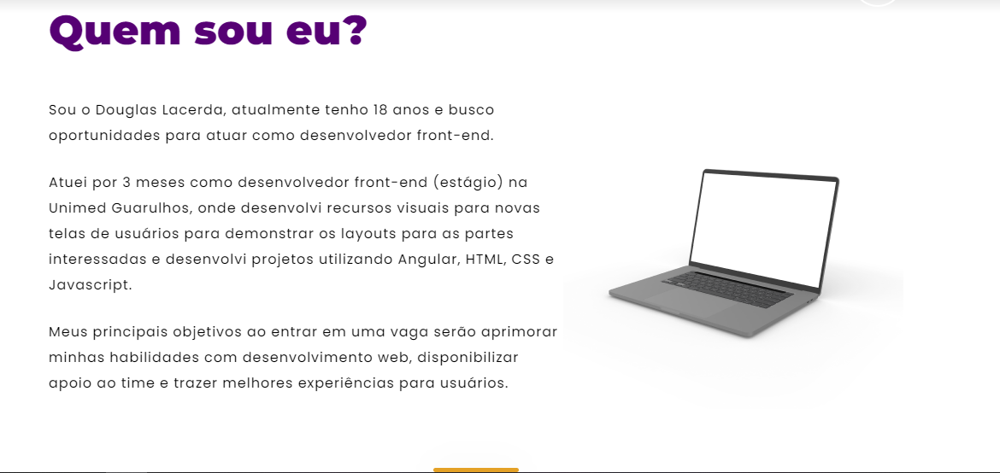
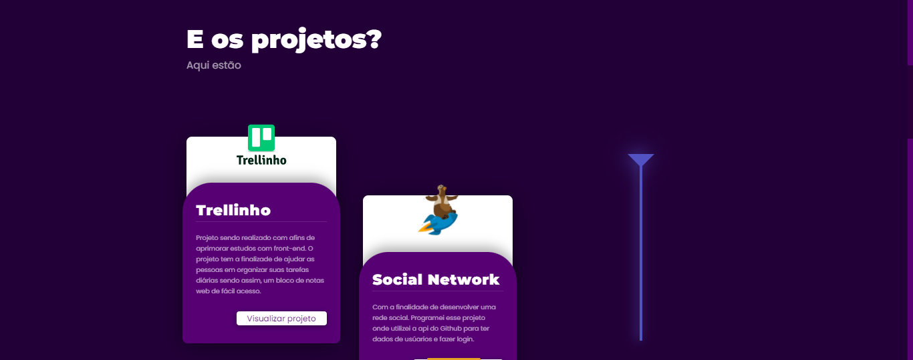
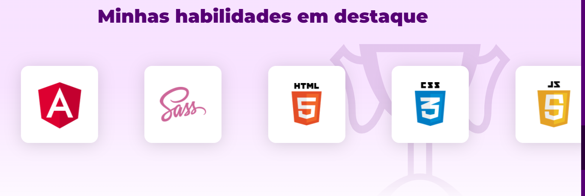

# Douglas Lacerda - Portfólio
A uns meses atrás desenvolvi o meu primeiro portfólio, onde pude aplicar minhas primerias habilidades com desenvolvimento front-end, onde obtive esse resultado:

Após alguns meses de aprendizado após o meu primeiro portfólio, decidi desenvolver uma nova release, onde agreguei ainda mais conhecimentos e novas tecnologias que não conseguia utilizar antigamente. E assim ficou a nova versão:

Meu principal objetivo em desenvolver esse projeto, além de demonstrar meu pequeno avanço, é demonstrar aos recrutadores minhas habilidades, pois atualmente estou cursando Análise e Desenvolvimento de Sistemas e estou em busca de uma oportunidade como desenvolvedor, onde eu possa aplicar minhas habilidades e disponibilizar apoio ao time.

# Demonstrando um pouco do projeto:

## Quem sou eu?
Aqui eu demonstro um pouco sobre mim

## Alguns projetos
Aqui eu demonstro alguns projetos que desenvolvi e postei no github.

## Habilidades
Aqui eu desenvolvi um slider onde pude colocar cada habilidade minha em cards e demonstrar facilmente.

## Tecnologias utilizadas durante o projeto:
- Angular
- SCSS
- Figma
- GIT

Link preview: <https://portfolio-douglc.vercel.app/>

